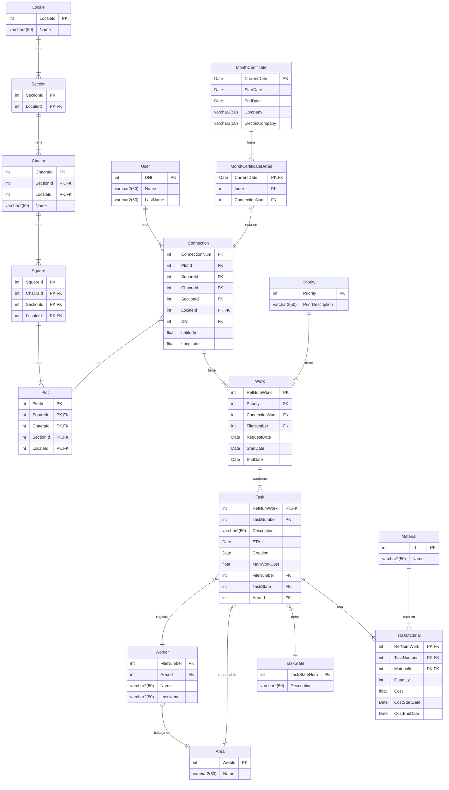

[Volver al README](./../README.md)

# Diagrama Entidad Relación

```mermaid
erDiagram
	Locale{
		int LocaleId PK
		varchar2(50) Name
	}
	Section{
		int SectionId PK
        int LocaleId PK,FK
    }
	Chacra{
		int ChacraId PK
		int SectionId PK,FK
        int LocaleId PK,FK
		varchar2(50) Name
	}
	Square{
		int SquareId PK
		int ChacraId PK,FK
		int SectionId PK,FK
        int LocaleId PK,FK
	}
	Plot{
		int PlotId PK
		int SquareId PK,FK
		int ChacraId PK,FK
		int SectionId PK,FK
        int LocaleId PK,FK
	}
	Connection{
		int ConnectionNum PK
		int PlotId FK
		int SquareId FK
		int ChacraId FK
		int SectionId FK
        int LocaleId PK,FK
        int DNI FK
        float Latitude
		float Longitude
	}
    User{
        int DNI PK
        varchar2(50) Name
        varchar2(50) LastName
    }

    Area{
        int AreaId PK
		varchar2(50) Name
	}
	Worker{
		int FileNumber PK
        int AreaId FK
		varchar2(50) Name
		varchar2(50) LastName
	}
	Work{
        int RefNumWork PK
        int Priority FK
		int ConnectionNum FK
		int FileNumber FK
		Date RequestDate
        Date StartDate
        Date EndDate
	}
    Priority{
        int Priority PK
        varchar2(50) PriorDescription
    }
	Task{
        int RefNumWork PK,FK
		int TaskNumber PK
        varchar2(50) Description
		Date ETA
		Date Creation
		float ManWorkCost
		int FileNumber FK
        int TaskState FK
        int AreaId FK
	}
	Material{
		int Id PK
		varchar2(50) Name
	}
	TaskMaterial{
        int RefNumWork PK,FK
        int TaskNumber PK,FK
        int MaterialId PK,FK
		int Quantity
		float Cost
		Date CostStartDate
		Date CostEndDate
	}
    TaskState{
        int TaskStateNum PK
        varchar2(50) Description
    }

    MonthCertificate{
        Date CurrentDate PK
        Date StartDate
        Date EndDate
        varchar2(50) Company
        varchar2(50) ElectricCompany
    }
    MonthCertificateDetail{
        Date CurrentDate PK,FK
        int Index PK
        int ConnectionNum FK
    }

    MonthCertificate ||--|{ MonthCertificateDetail : tiene
    MonthCertificateDetail }|--|| Connection: "esta en"
    
	Locale ||--|{ Section : tiene
	Section ||--|{ Chacra : tiene
	Chacra ||--|{ Square : tiene
	Square ||--|{ Plot : tiene
	Connection }|--|| Plot : tiene
    
	Connection ||--|{ Work : tiene
	Worker }|--|| Area : "trabaja en"
    Task }|--|| Worker : registra
	Task }|--|| Area : resposable
	Work ||--|{ Task : contiene
    Task }|--|| TaskState : tiene
	Task ||--|{ TaskMaterial : usa
	Material ||--|{ TaskMaterial : "esta en"
    Priority ||--|{ Work : "tiene"
    User ||--|{ Connection : "tiene"
```

Worker ||--|{ Work : tiene
