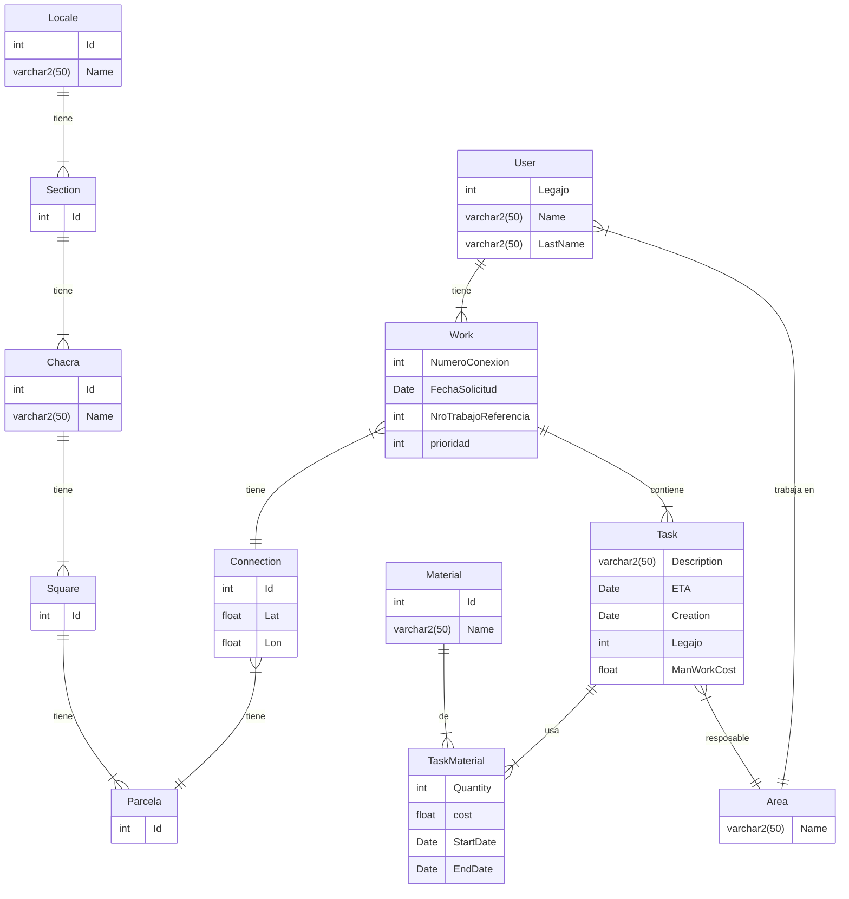

[Volver al README](./../README.md)

# Diagrama Entidad Relación

```mermaid
erDiagram
	Area{
		varchar2(50) Name
	}
	Chacra{
		int Id
		varchar2(50) Name
	}
	Connection{
		int Id
		float Lat
		float Lon
	}
	Locale{
		int Id
		varchar2(50) Name
	}
	Material{
		int Id
		varchar2(50) Name
	}
	TaskMaterial{
		int Quantity
		float cost
		Date StartDate
		Date EndDate
	}
	Parcela{
		int Id
	}
	Section{
		int Id
    }
	Square{
		int Id
	}
	Task{
		varchar2(50) Description
		Date ETA
		Date Creation
		int Legajo
		float ManWorkCost
	}
	User{
		int Legajo
		varchar2(50) Name
		varchar2(50) LastName
	}
	Work{
		int NumeroConexion
		Date FechaSolicitud
		int NroTrabajoReferencia
		int prioridad
	}
    
	Material ||--|{ TaskMaterial : de
	Task ||--|{ TaskMaterial : usa
	Task }|--|| Area : resposable
	User ||--|{ Work : tiene
	Work ||--|{ Task : contiene
	Work }|--|| Connection : tiene
	User }|--|| Area : "trabaja en"

	Locale ||--|{ Section : tiene
	Section ||--|{ Chacra : tiene
	Chacra ||--|{ Square : tiene
	Square ||--|{ Parcela : tiene
	Connection }|--|| Parcela : tiene
```
